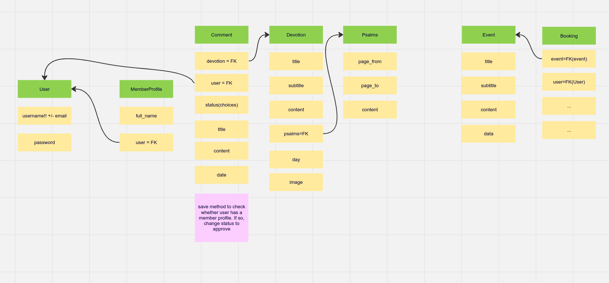
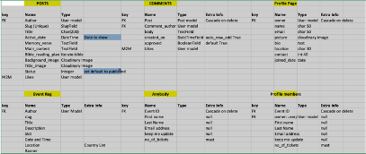
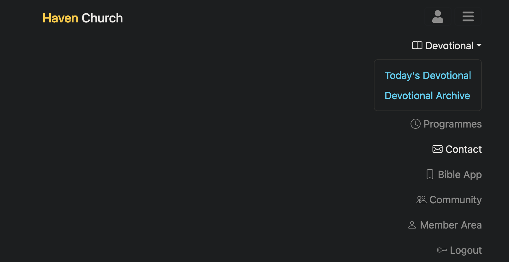

# 

## Welcome,
Haven Daily devotional is a product of Haven Church. The devotional is a source of spiritual enrichment for Christians. Aside from daily devotional, the website features a bible app, an event registration platform and a social page for connecting with other registered and profiled members.
 

The link to the deployed site can be found [Here](https://devotional-db11bc3466f9.herokuapp.com/)

## User Stories

### First-Time Visitor Goals: 
As a first-time visitor, the goals are:

- Read current and archived devotionals
- Comment on devotionals
- View upcoming events
- Register for an event
- Register as a basic user
- Contact the church through the website

### Member Goals: 
As a member, the goals are:
- Read current and archived devotionals
- Comment on devotionals
- Like a devotional and comments from others
- View upcoming events
- Register for an event
- Register as a basic user
- Become a member by creating my profile
- View profiles of other members
- View and study the Holy bible
- Contact the church through the website

### Admin/Owner Goals: 
As an admin, the goals are:
- Create devotionals and assign dates that they become active
- Create events and assign important dates and slots to it
- Approve new user registration
- Suspend/delete user profiles and accounts
- Delete comments from posts

## Logic Flowchart 
# 

## Entity Relationship Diagram (Models)
# 

## Features 
# 
## Devotional: 
- The site enables users to view devotionals. Daily, the devotional page automatically loads the currently active date devotional and after that archives it. Future devotionals are not seen on the current page or in the archive.
- Users can like and comment on devotionals. They can also like the comments of others.
- Visitors can only view devotionals but cannot interact with them by comment or like which can only be done by registered members.

## Programmes/Events: 
- The site enables website visitors to register for events. A notable event feature is the slot. Once full, a message would be passed to the user, informing them that the slot for the event is full.
- Registered members do not need to input details if logged in. They can simply click register and they will be registered for the programme.

## Contact: 
- Anyone can contact the website owners by using the contact form on the home page.

## Bible App: 
- This is a member-only feature. Once logged in, a user can view all bible books from the King James Version

## Community: 
- This is a member-only feature. Once logged in, a user can view profiles of other users that have created a profile

## Member Area: 
- This is a member-only feature. A registered user is not necessarily a member. What qualifies a user to become a member is when they create their profile. They can also edit and delete their profiles. On profile creation, the basic details from the user registration database are automatically loaded to the form (i.e. First name, Last name, and email) to enable a swift profile creation.
- When a profile is created, a user can also use the form to update their details. When this form is filled, the "transaction.atomic" function helps to update the two tables (user and profile) simultaneously.

## 404 and 500 Error: 
- When something is not right the site has a 404 and 500 error page to handle that by providing users with information so they are aware and can continue using the site.

## Testing
Rigorous manual testing was performed to ensure the app's functionality, including user inputs, menu navigation, and responsiveness across screens.
View the album of all testing including Pep8, Page Insight and W3
- [Click here to view screenshots - TESTING.md](TESTING.md) 

### Manual Testing: 
| Feature | Action | Expected Result | Tested | Passed | Comments |
| --- | --- | --- | --- | --- | --- |
|  |  |  |  |  |  |
| Logo | Click on Haven church logo | User is redirected to index.html | yes | Yes | - |
| Today's Devotional | Click on Link | User is redirected   | yes | Yes | - |
| Devotional Archive| Click on Link | User is redirected | yes | Yes | - |
| Contact | Click on Link | User is redirected to the contact form | yes | Yes | - |
| Programmes | Click on Link | User is redirected | yes | Yes | - |
| Community | Click on Link | User is redirected | yes | Yes |  When Logged in  |
|  |  |  |  |  |  
| Member Area | Click on Button | User is redirected | yes | Yes |  When Logged in  |
| Login | Click on Button | User is redirected | yes | Yes | - |
| Logout | Click on Button | User is redirected | yes | Yes | - |
| Delete Comment | Click on Button | User is redirected | yes | Yes |  When Logged in |
| Like Comment | Click on Button | User is redirected | yes | Yes |  When Logged in  |
| |  |  |  |  |  
| Register event | Click on icon | User is redirected | yes | Yes | - |
| Update Profile | Click on icon | User is redirected | yes | Yes | When Logged in |
| Delete Profile | Click on icon | User is redirected | yes | Yes | - |
| Programme Archive | Click on Link | User is redirected | yes | Yes | - |

### Browser Testing:
The final project was tested on four different browsers, namely:
-Microsoft Internet explorer
-Google Chrome
-Brave
-Mozilla Firefox
The output was similar on all these browsers except on Mozila firefox, where the fonts appeared darker and were therefore better viewed in terms of clarity and contrast. In addition, the buttons on the "get-involved" section (not page) of the index page were observed to overlap the text above them. I was able to correct this error by adding more padding on top of the buttons.

### Google PageSpeed Insights:
Google page speed insights was used to test the speed of the website and various issues were highlighted which was followed by subsequent adjustments.
A notable issue raised was that of the body font being high in contrast. The font (Diphlliea) was then changed to Roboto. High contrast fonts are difficult to read by some users and also on some devices.

## Bugs:
| Issue|Solution |
|-|-|
| The profile pictures of users who uploaded images through their Iphones was not showing. The was because Apples image extension is different from what was expected.|After researching cloudinary's website, I learnt about the CloudinaryImage class. It enabled me to convert any image format to jpg before storing to the database|

### CI Python Linter:
The CI Python Linter https://pep8ci.herokuapp.com/ was used to test for errors in the code. All codes were then formatted by following the software's recommendation.

### W3 Validator:
The W3 validator was used to check errors and all found errors were correct. There were however warnings concerning text with the "article" elements on the devotional pages and programmes page. The warning advised on the use of headings (h2-h6) to write the articles.

## Technologies used:
- [Django](https://docs.djangoproject.com/) is the web framework that was used to manage this project.
- [Bootstrap](https://getbootstrap.com/) is the web framework used for custom components and layouts.
- [Python](https://python.org) is the main technology used in this application
- [Lucid](https://lucid.com) was used to create workflows for guidance in building the application
- [VScode](https://vscode.com/) was used to write and edit the codes and host the site on my local  computer
- [Git](https://github.com) was used for the version control of the application
- [Heroku](https://heroku.com) was used to host the deployed application
- [ChatGPT](https://chat.openai.com/) was often consulted regarding the usage and construction of codes
- [Google Chrome](https://chrome.google.com/) Developer tool was often used to check issues arising from codes, responsiveness, and general testing.
- [Code Institute Python Linter](https://pep8ci.herokuapp.com/) was used to check code for any issues
- [Bible API](https://bible-api.com/) This API was used to fetch all the bible passages and is the main engine for the Bible App
### Languages Used

* [HTML5](https://en.wikipedia.org/wiki/HTML5)
* [CSS3](https://en.wikipedia.org/wiki/CSS)
* [JavaScript](https://en.wikipedia.org/wiki/JavaScript)
* [Python](https://en.wikipedia.org/wiki/Python_(programming_language))

## Deployment

The template for this app was generated from Code-Institute-Org/p4-template. The repository was cloned on a local VSCode machine and then stored/managed on GitHub. 

The Heroku git URl is https://git.heroku.com/devotional.git

The app was then deployed on Heroku via Github:

1. Heroku Account Setup:

    Log in to your existing Heroku account or create a new account.

2. Create a New App:

    On the Heroku dashboard, click "New" and select "Create new app."

3. Configure Your App:

    Choose a unique app name and select your preferred region.
    Click "Create app" to initiate the app creation process.

4. Environment Configuration:

    In the app dashboard, find the "Settings" tab and locate "Config Vars."
    Click "Reveal Config Vars" and add a new variable with the key "PORT" and the value "8000." Click "Add" to save.

5. Set Up Buildpacks:

    Scroll down to the "Buildpack" section in the settings.
    Click "Add," select "Python," and add it. Ensure that "Python" is listed first.
    Repeat the process, this time adding "Node.js" as a build pack.

6. Deploy Your App:

    Navigate to the "Deploy" tab at the top of the dashboard.
    Choose GitHub as your deployment method and link your repository to the app.

7. Automatic or Manual Deployment:

    Scroll down to the deployment section.
    Choose either "Enable Automatic Deploys" for continuous integration or "Manual Deploy" for manual control.

Deployed site -> [Here](https://devotional-db11bc3466f9.herokuapp.com/)

### Local Deployment:
To clone this project, you can do so using VsCode or any code editor that has an integrated development Environment (IDE), using this command: 

1. Clone the repository: `git clone https://github.com/your-username/daily-devotional.git`
2. Install dependencies: `pip install -r requirements.txt`

## Requirements and Dependencies

- [Requirements](https://github.com/dcsndevs/daily-devotional/blob/main/requirements.txt)

## Usage

Follow the on-screen prompts to navigate through the application. Input valid data as guided by the application.

## Future Development and Limitations
- Work on a feature that allows users to send messages to others would be implemented shortly.
- Automatic email responses would be implemented as well. As of now, the site admin has to manually contact users and update on changes.

## Credits

### Code Institute:
Special thanks to Code Institute for providing the template used in this project. The template served as a valuable foundation, streamlining the development process and contributing to the overall project structure and thereafter deployment.

### API: 
I am grateful to bible-api.com for allowing me and thousand of developers to use their API.

### ElephantSQL Database

1. Click Create New Instance to start a new database.
2. Provide a name (this is commonly the name of the project: tribe).
3. Select the Tiny Turtle (Free) plan.
4. You can leave the Tags blank.
5. Select the Region and Data Center closest to you.
6. Once created, click on the new database name, where you can view the database URL and Password.

### Cloudinary

1. For Primary interest, you can choose Programmable Media for image and video API.
2. Optional: edit your assigned cloud name to something more memorable.
3. On your Cloudinary Dashboard, you can copy your API Environment Variable.
4. Be sure to remove the CLOUDINARY_URL= as part of the API value; this is the key.

### Heroku Deployment
* Log into [Heroku](https://www.heroku.com/) account or create an account.
* Click the "New" button at the top right corner and select "Create New App".
* Enter a unique application name
* Select your region
* Click "Create App"

#### Prepare enviroment and settings.py
* In your GitPod workspace, create an env.py file in the main directory.
* Add the DATABASE_URL value and your chosen SECRET_KEY value to the env.py file.
* Update the settings.py file to import the env.py file and add the SECRETKEY and DATABASE_URL file paths.
* Comment out the default database configuration.
* Save all files and make migrations.
* Add the Cloudinary URL to env.py
* Add the Cloudinary libraries to the list of installed apps.
* Add the STATIC files settings - the url, storage path, directory path, root path, media url and default file storage path.
* Link the file to the templates directory in Heroku.
* Change the templates directory to TEMPLATES_DIR
* Add Heroku to the ALLOWED_HOSTS list the format ['app_name.heroku.com', 'localhost']

#### Add the following Config Vars in Heroku:

* SECRET_KEY - This can be any Django random secret key
* CLOUDINARY_URL - Insert your own Cloudinary API key
* PORT = 8000
* DISABLE_COLLECTSTATIC = 1 - this is temporary and can be removed for the final deployment
* DATABASE_URL - Insert your own ElephantSQL database URL here

#### Heroku needs two additional files to deploy properly

* requirements.txt
* Procfile

#### Deploy

1. Make sure DEBUG = False in the settings.py
2. Go to the deploy tab on Heroku and connect to GitHub, then to the required repository.
3. Scroll to the bottom of the deploy page and either click Enable Automatic Deploys for automatic deploys or Deploy Branch to deploy manually. Manually deployed branches will need re-deploying each time the GitHub repository is updated.
4. Click 'Open App' to view the deployed live site.

### Docs

* [Stack Overflow](https://stackoverflow.com/)
* [Code Institute](https://learn.codeinstitute.net/dashboard)
* [Bootstrap 4.6](https://getbootstrap.com/docs/4.6/getting-started/introduction/)
* [Django docs](https://docs.djangoproject.com/en/4.2/releases/3.2/)
* [Django Allauth](https://django-allauth.readthedocs.io/en/latest/)
* [Django and Static Assets](https://devcenter.heroku.com/articles/django-assets)
* [Cloudinary](https://cloudinary.com/documentation/diagnosing_error_codes_tutorial)
* [Google](https://www.google.com/)

### Code Reference:
[W3schools](https://w3schools.com/) was instrumental to the success of this project. It was often used to learn quick features or to compare and see where errors are.

### Images:

All the images used in the creation of this website were sourced on Pexels, Unsplash and W3 websites. Below is a list of the images used and their links: 
1. The hero image was gotten from canva and no reference was given for it
2. The bible image on the home page is credited to - Photo by Craig Adderley: (https://www.pexels.com/photo/man-sitting-on-sofa-reading-book-1467564/)
3. The Pastor image belongs to me - (https://res.cloudinary.com/djhi60enx/image/upload/f_auto,q_auto/lz8ojqlp5jxhenubqev8)

### Acknowledgments:
I like to thank [Juliia Konn](https://github.com/IuliiaKonovalova/), my mentor at Code Institute. She exemplifies her mentorship with a knack for high-quality projects. Her desire for quality has always challenged me to do better in my work. I remain grateful to her. Juliia challenged me to add the events feature and I did!.

I also like to thank my loving wife for her continuous support. She's a source of strength as always.